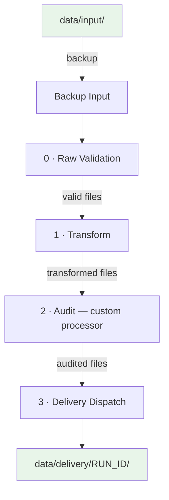

# Architecture Overview

This page describes the high-level design of Pangolin, its folder structure, and how data flows through the system.

Pangolin is an installable library with a CLI: `pip install` it, run `pangolin init` in an empty folder, and you get a ready-to-run **project** (config, registries, example pipeline, custom code stubs) in its own folder — the engine ships inside the `pangolin` package. This repository (`pangolin` itself) contains **only the library** — no runnable project lives at its root. See [[Getting Started]] for the two-repo picture (library repo vs. project repo).

---

## Library Layout (this repo)

```
pangolin/                          # this repo — the library, nothing else
├── src/pangolin/
│   ├── cli/                       # Typer CLI: init, run, list, step, restore, deploy, bootstrap
│   ├── _scaffold/
│   │   └── project_template/      # Project skeleton copied by `pangolin init`
│   │       ├── config/            # data_structure.yaml + registries/ (example)
│   │       ├── custom/            # example validators/transformers/processor
│   │       ├── pipelines/         # example_pipeline.py
│   │       ├── example_input/     # sample CSV, copied into data/input/
│   │       ├── template.env, template.gitignore   # renamed to .env / .gitignore on copy
│   │       └── docker/, docker-compose.yml, Makefile, make.ps1   # only with `pangolin init -d`
│   ├── config/
│   │   ├── settings.py            # pydantic-settings SETTINGS class
│   │   └── run_context.py         # RunContext (per-run dynamic state)
│   ├── engine/
│   │   ├── DataFacility.py        # YAML-driven data access layer
│   │   ├── reporter.py            # Per-step report writer
│   │   ├── common/
│   │   │   ├── exceptions.py      # Pipeline exception hierarchy
│   │   │   └── logger.py          # Structured processor logger
│   │   └── processors/
│   │       ├── BaseProcessor.py   # Abstract base class
│   │       ├── BackupRestore.py   # Backup & restore input files
│   │       ├── DataValidator.py   # Runs validation rules
│   │       ├── DataTransformer.py # Runs transformation chains
│   │       └── FileDispatcher.py  # Routes files to subfolders
│   └── utils/
│       ├── validators.py          # Built-in validator functions
│       ├── transformers.py        # Built-in transformer functions
│       └── fs_wrapper.py          # fsspec-based filesystem abstraction
└── docs/
    └── documentation-obsidian/    # this Obsidian vault
```

## Project Layout (generated by `pangolin init`, lives in its own repo)

```
my-project/
├── .env                            # BASEPATH/DATAPATH, folder names, IO options
├── README.md                       # generated: mandatory setup + settings reference (see below)
├── config/
│   ├── constants.py
│   ├── data_structure.yaml         # Declarative folder/file schema
│   └── registries/                 # YAML rules for each pipeline step
│       ├── 0_raw_validation.yaml
│       ├── 1_transform.yaml
│       ├── 2_audit.yaml
│       └── 3_dispatcher.yaml
├── custom/
│   ├── validators.py               # project-specific validators
│   ├── transformers.py             # project-specific transformers
│   └── processors/                 # project-specific processor classes
├── pipelines/
│   ├── __init__.py                 # auto-discovery: scans this folder, builds PIPELINES dict
│   └── example_pipeline.py         # backup → validate → transform → audit → dispatch
├── data/                            # NOT committed (gitignored); created by `pangolin init`
│   ├── input/, staging/<RUN_ID>/, delivery/<RUN_ID>/, reports/<RUN_ID>/, static/, backup/
└── docker/, docker-compose.yml, Makefile, make.ps1   # only with `pangolin init --dockerization`
    ├── Dockerfile                  # installs the `pangolin` package + copies this project
    ├── Caddyfile                   # reverse-proxy config (*.localhost / cloud hostname)
    ├── prefect_manifest.yaml       # declares all Prefect Variables and Blocks
    ├── README.md                   # generated: docker-specific setup
    └── .env.docker.example         # template — copy to .env.docker and fill in
```

`pangolin init` writes a `README.md` (mandatory setup steps + a settings table generated live from `pangolin.config.settings.SETTINGS`) and, with `--dockerization`, a `docker/README.md` on top of this — read those first in a freshly scaffolded project.

---

## Pipeline Flow

The pipeline is orchestrated by **Prefect** and its structure is **fully configurable** — you decide how many steps to run, in what order, and what each step does. The example pipeline scaffolded by `pangolin init` ships with 4 stages (plus a backup step):



| Step | Processor | Registry | Purpose |
|------|-----------|----------|---------|
| — | `BackupRestore` | *(none)* | Copies current input to `backup/<RUN_ID>/` |
| 0 | `Validator` | `0_raw_validation.yaml` | Checks raw input quality (columns exist, not empty) |
| 1 | `DataTransformer` | `1_transform.yaml` | Applies ordered transformations (calculate, enrich) |
| 2 | `AuditProcessor` (custom, `custom/processors/example_processor.py`) | `2_audit.yaml` | Example custom processor — counts nulls per file |
| 3 | `FileDispatcher` | `3_dispatcher.yaml` | Dispatches final files by pattern into `delivery/` |

> [!note]
> This is just the example configuration. You can add, remove, or reorder steps freely — including custom processor types like the audit step above. See [[Pipeline Configuration]] and [[Creating a New Processor]] for details.

---

## Key Components

### 1. Settings (`src/pangolin/config/settings.py`)
A `pydantic-settings` `BaseSettings` class that provides paths, backend engine, CSV delimiter, output format, and run ID. Every module accesses it via `get_settings()`, which returns a fresh `SETTINGS` instance. Fields are type-checked and validated automatically by Pydantic.

In **local** mode it reads `.env` directly. In **docker-local / cloud** mode, `pangolin deploy` (which replaced the old `docker/deploy.py` script) writes values from Prefect Variables and Blocks into `os.environ` *before* the settings class is ever instantiated, so `SETTINGS` receives them transparently — no code change needed. See [[Docker Deployment]].

### 2. DataFacility (`src/pangolin/engine/DataFacility.py`)
A YAML-driven data access layer that maps `data_structure.yaml` onto the filesystem. It provides a navigable Python object tree (e.g. `D.static.mappings.product_mapping.read()`) with built-in I/O, versioning, and timestamped folders. See [[Data Structure & DataFacility]].

### 3. Processors (`src/pangolin/engine/processors/`)
Each processor inherits from `BaseProcessor`, which handles:
- Loading the YAML registry
- Discovering input files
- Pattern-matching files to registry entries
- Reading/writing via `FSWrapper`
- Integrating with `DataFacility`

Three concrete processors exist: `Validator`, `DataTransformer`, `FileDispatcher`. See [[Creating a New Processor]].

### 4. Registry Files (`config/registries/`)
YAML files that drive each step. They map **file-name patterns** (globs) to rules. See [[Registry Reference]].

### 5. Validators & Transformers (`utils/`)
Decorated Python functions registered at import time. The registry YAML references them by function name. See [[Writing Validators]] and [[Writing Transformers]].

### 6. FSWrapper (`utils/fs_wrapper.py`)
An `fsspec`-based abstraction that makes all file operations work on local disk, S3, GCS, or Azure — controlled by `FS_PROTOCOL` in `.env`.

### 7. Docker Layer (`docker/`, project-side, only with `pangolin init --dockerization`)
Everything needed to run a project as a containerised stack is scaffolded into `docker/`. Four services are orchestrated by `docker-compose.yml`:

| Service | Image | Role |
|---------|-------|------|
| `prefect-server` | `prefecthq/prefect` | Prefect API + UI |
| `bootstrap` | project image | One-shot manifest applier — runs `pangolin bootstrap`, creates Variables and Blocks, then exits |
| `worker` | project image | Runs `pangolin deploy` — registers every pipeline in `pipelines/` and serves runs |
| `caddy` | `caddy:2` | Reverse proxy — exposes UI on `localhost` and `<project>.localhost` |

The project's `docker/Dockerfile` installs the `pangolin` library itself (`pip install pangolin`, currently via git since it isn't published yet — see the generated `docker/README.md`) and copies the project on top. Runtime config is declared in `docker/prefect_manifest.yaml` (committable) and secrets live in `docker/.env.docker` (gitignored). See [[Docker Deployment]].

---

## Data Isolation

Every pipeline run generates a unique **RUN_ID** (e.g. `20260324_185705`). Timestamped folders (`staging`, `delivery`, `reports`) use the RUN_ID as a subfolder, so each run is fully isolated and previous outputs are never overwritten.

---

Next: [[Getting Started]] →
