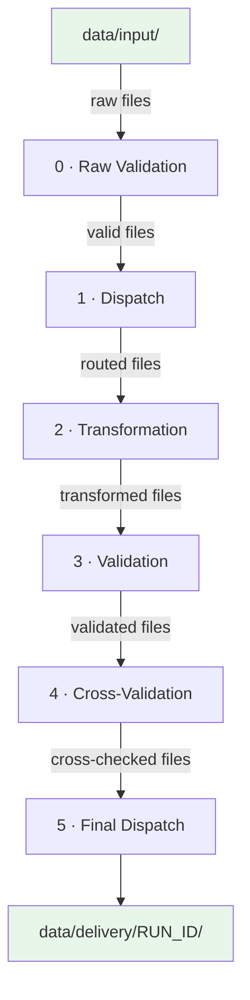

# Architecture Overview

This page describes the high-level design of Pangolin, its folder structure, and how data flows through the system.

Pangolin is designed as a battle-ready template: every folder, file, and abstraction has a deliberate place so that when you start a new project you fork the repo, adjust the registries and `data_structure.yaml`, and write your domain logic — the engine and scaffolding are already there.

---

## Project Structure

```
pangolin/
├── main.py                        # Prefect flow entry point
├── config/
│   ├── settings.py                # .env loader → pydantic-settings SETTINGS
│   ├── constants.py               # Shared constants
│   ├── data_structure.yaml        # Declarative folder/file schema
│   └── registries/                # YAML rules for each pipeline step
│       ├── 0_raw_validation.yaml
│       ├── 1_dispatcher.yaml
│       ├── 2_transform_registry.yaml
│       ├── 3_validation.yaml
│       ├── 4_cross_validation.yaml
│       └── 5_dispatcher.yaml
├── engine/
│   ├── DataFacility.py            # YAML-driven data access layer
│   ├── reporter.py                # Per-step report writer
│   ├── core/
│   │   ├── exceptions.py          # Pipeline exception hierarchy
│   │   └── logger.py              # Structured processor logger
│   └── processors/
│       ├── BaseProcessor.py       # Abstract base class
│       ├── DataValidator.py       # Runs validation rules
│       ├── DataTranformer.py      # Runs transformation chains
│       └── FileDispatcher.py      # Routes files to subfolders
├── utils/
│   ├── validators.py              # Registered validator functions
│   ├── transformers.py            # Registered transformer functions
│   └── fs_wrapper.py              # fsspec-based filesystem abstraction
├── test_files_generator/
│   └── generator.py               # Generates sample test data
└── .env                           # Environment configuration

# The data/ folder is NOT in the repo (gitignored).
# It is created at runtime and in the example is structured as:
#   data/input/            ← drop raw files here
#   data/staging/<RUN_ID>/ ← intermediate step outputs
#   data/delivery/<RUN_ID>/← final pipeline output
#   data/reports/<RUN_ID>/ ← validation & transform reports
#   data/static/           ← reference files (mappings, snapshots)
```

---

## Pipeline Flow

The pipeline is orchestrated by **Prefect** and its structure is **fully configurable** — you decide how many steps to run, in what order, and what each step does. The default configuration ships with 6 stages as an example:



| Step | Processor | Registry | Purpose |
|------|-----------|----------|---------|
| 0 | `Validator` | `0_raw_validation.yaml` | Checks raw input quality (columns exist, not empty, IDs valid) |
| 1 | `FileDispatcher` | `1_dispatcher.yaml` | Routes files into subfolders by pattern (e.g. `*sales*` → `SALES/`) |
| 2 | `DataTransformer` | `2_transform_registry.yaml` | Applies ordered transformations (enrich, clean, calculate) |
| 3 | `Validator` | `3_validation.yaml` | Validates transformed data (new columns present, schema OK) |
| 4 | `Validator` | `4_cross_validation.yaml` | Cross-file checks (null values, value ranges) |
| 5 | `FileDispatcher` | `5_dispatcher.yaml` | Dispatches final files by region (`FR/`, `US/`) |

> [!note]
> This is just the default configuration. You can add, remove, or reorder steps freely. See [[Pipeline Configuration]] for details.

---

## Key Components

### 1. Settings (`config/settings.py`)
A `pydantic-settings` `BaseSettings` class loaded from `.env` that provides paths, backend engine, CSV delimiter, output format, and run ID. Every module accesses it via `get_settings()`, which returns a fresh `SETTINGS` instance. Fields are type-checked and validated automatically by Pydantic.

### 2. DataFacility (`engine/DataFacility.py`)
A YAML-driven data access layer that maps `data_structure.yaml` onto the filesystem. It provides a navigable Python object tree (e.g. `D.static.mappings.product_mapping.read()`) with built-in I/O, versioning, and timestamped folders. See [[Data Structure & DataFacility]].

### 3. Processors (`engine/processors/`)
Each processor inherits from `BaseProcessor`, which handles:
- Loading the YAML registry
- Discovering input files
- Pattern-matching files to registry entries
- Reading/writing via `FSWrapper`
- Integrating with `DataFacility`

Three concrete processors exist: `Validator`, `DataTransformer`, `FileDispatcher`. See [[Creating a New Processor]].

### 4. Registry Files (`config/registries/`)
YAML files that drive each step. They map **file-name patterns** (globs) to rules. See [[Registry Reference]].

### 5. Validators & Transformers (`utils/`)
Decorated Python functions registered at import time. The registry YAML references them by function name. See [[Writing Validators]] and [[Writing Transformers]].

### 6. FSWrapper (`utils/fs_wrapper.py`)
An `fsspec`-based abstraction that makes all file operations work on local disk, S3, GCS, or Azure — controlled by `FS_PROTOCOL` in `.env`.

---

## Data Isolation

Every pipeline run generates a unique **RUN_ID** (e.g. `20260324_185705`). Timestamped folders (`staging`, `delivery`, `reports`) use the RUN_ID as a subfolder, so each run is fully isolated and previous outputs are never overwritten.

---

Next: [[Getting Started]] →
